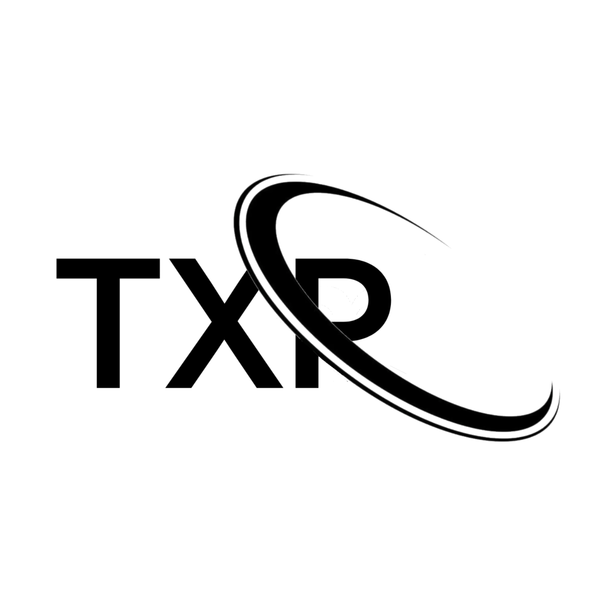

# The X Project

**An Independent Tech Ecosystem, Run an x86 OS, mX in Android. No root, no PC.**

## txp
TXP (The X Project) — an independent technology ecosystem developing its own software stack, including the cX programming language, XLoader bootloader, Kernel24, and mX operating system. Built independently with a focus on low-level development, experimentation, and creating technology from the ground up.
